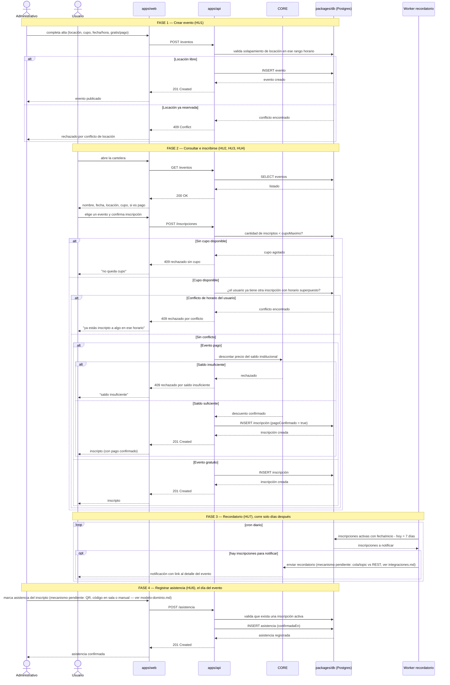

# Flujo de datos — recorrido de negocio

> Diagrama pedido en `../01-proyecto/plan-de-definicion.md` (Fase 2, punto 8) para la 1° Entrega: desde que un administrativo crea un evento hasta que un usuario se inscribe, paga (si aplica), recibe el recordatorio y se le registra la asistencia. Complementa a [`stack-y-estructura.md`](stack-y-estructura.md#flujo-de-datos), que describe las capas técnicas (web → CORE → api → db); este documento describe el recorrido de negocio en sí, con las validaciones de cada HU.

No incluye a Analítica Institucional (consume eventos nuestros, pero su contrato sigue "Pendiente" en [`integraciones.md`](integraciones.md) y no está dentro del alcance que pide `plan-de-definicion.md` para este diagrama) ni a HU5/HU8 (son consultas de lectura, no pasos de este recorrido).

Todo request a `apps/api` requiere un JWT válido de CORE (`common/guards/core-jwt.guard.ts`) — se omite del diagrama para no repetirlo en cada flecha. Hoy ese guard es un placeholder que siempre deja pasar (ver `integraciones.md`); lo que sigue es el flujo objetivo, no el estado actual de la integración.

## Notas de lectura

- Las ramas de rechazo (`alt`) son las mismas de los criterios Given/When/Then de HU1/HU3/HU4 en [`../01-proyecto/backlog.md`](../01-proyecto/backlog.md) — no son un agregado del diagrama, son la traducción visual de esos criterios.
- Fase 3 y Fase 4 pasan **días o semanas después** de la Fase 2, no en la misma sesión de usuario — el `loop`/cron de la Fase 3 y el "el día del evento" de la Fase 4 marcan ese salto en el tiempo.
- CORE aparece en tres roles distintos según la fase (autenticación implícita en todo el diagrama, descuento de saldo en Fase 2, envío de notificación en Fase 3) — los tres contratos siguen "Pendiente" en [`integraciones.md`](integraciones.md); nada de esto está implementado contra CORE real todavía, son mocks a construir para la 2° Entrega.
